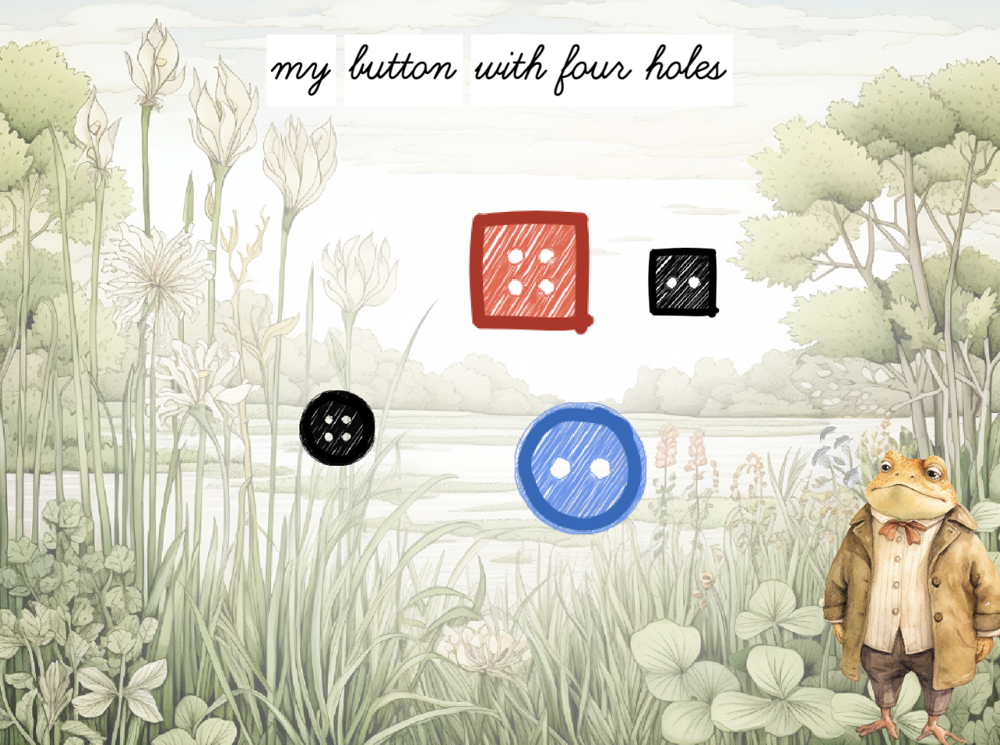

# The Missing Button

A game for 3-4 year olds inspired by "Frog and Toad" and the Montessori game "Detective Adjective".

The game is built on the excalibur.js engine and deployed as a NextJS PWA.

Graphics are from Midjourney and voices from Eleven Labs.
